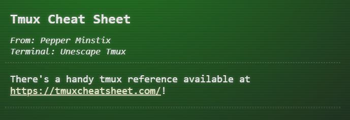
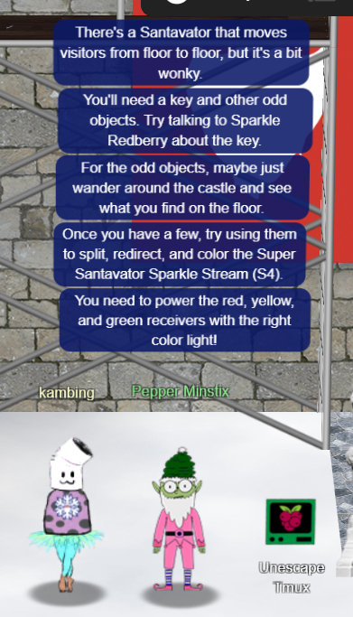

# Pepper Minstix

---

## Unescape Tmux


*Current Area: Castle Approach*


### Hints

1. 

   https://tmuxcheatsheet.com/
   
   

### Solution

Clicking on the Kringle Kiosk will reveal a terminal with the following text:

```
Can you help me?

I was playing with my birdie (she's a Green Cheek!) in something called "tmux",
then I did something and it disappeared!

Can you help me find her? We were so "attach"ed!!
elf@7b5cd06a67a4:~$ 
```

Using the hints and also the tmux cheatsheet, we enter:

```
tmux attach
```

This displays the Green Cheek bird on the terminal:


Let's click back on Pepper Minstix:



---

