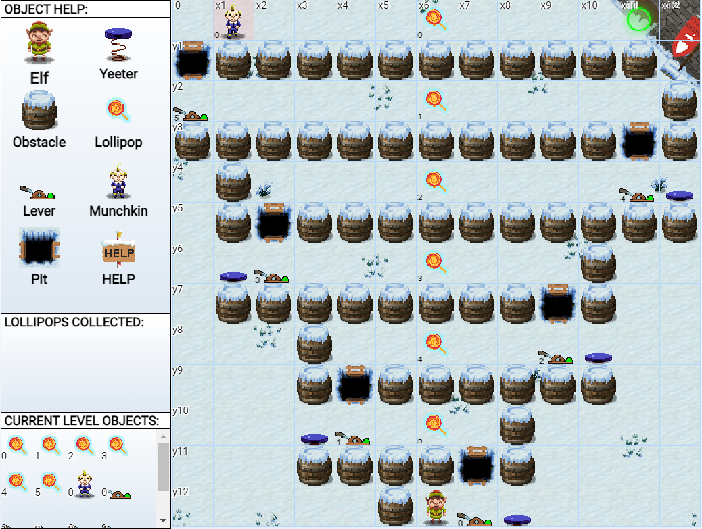

# Ribb Bonbowford

---

## The Elf Code


*Current Area: Dining Room*


## Hints

1. 

   [JavaScript](https://jgthms.com/javascript-in-14-minutes/)
   
   [JavaScript playground](https://playcode.io/).
   
   
   
2. 

   

3. 

   [There's got to be a way to `filter` for specific `typeof` items in an array](https://developer.mozilla.org/en-US/docs/Web/JavaScript/Reference/Global_Objects/TypedArray/filter)

   [the `typeof` operator](https://developer.mozilla.org/en-US/docs/Web/JavaScript/Reference/Operators/typeof)

   

4. 

   [In JavaScript you can enumerate an object's keys using `keys`, and filter the array using `filter`](https://stackoverflow.com/questions/9907419/how-to-get-a-key-in-a-javascript-object-by-its-value).

   

5. 

   [make your code shorter](https://jscompress.com/)

   

6. 

---

## 

## About

Munchkins have stolen all the lollipops from the North Pole and scattered them outside all of the entrances to KringleCon. Use your programming skills to collect all the lollipops and return to the entrance of KringleCon. Be on the lookout for munchkins or traps as they will cause you to have to start the level all over again!

## Info

Move to the lever, `elf.get_lever(0)`, and manipulate the resulting data however it asks, and send the answer to `elf.pull_lever(answer)`. The yeeter should release, and you can move freely.

Click on the object help and current level object icons for examples on how to complete this task.

## How To Play *The Elf C0de*

Use the console  to type in JavaScript code to control your  on the game window:


To accomplish this, you will need to use elf commands such as `elf.moveLeft(1)` or `elf.moveRight(2)`.

To find out all of the elf functions and or object related functions, you can click on the corresponding object in the help window:


## Objective

Collect all of the Lollipops  on the map and reach the End Goal  found at the entrance of KringleCon:


Each time you collect a Lollipop, it will appear in the  window.

## Be Careful!

Munchkins  could be roaming the map looking to challenge your JavaScript (JS) skills. You will have to restart if caught by a munchkin without first solving their JS challenge using `elf.tell_munch(answer)`.

**Note:** You do not want to stand in the same square as the Munchkin when telling them an answer. Instead, you must simply be within 1 grid square in any direction (including diagonal).

Additionally, be careful to avoid  **Yeeter** spring traps set by the munchkins all over the map, or you could find your elf yeeted off the map.

Pits  are also dangerous if their bridge is down . However, munchkins are notorious for not watching where they step and will fall into any pit with a downed bridge that lies in their path.

Obstacles such as  or  will block your elf from moving through its corresponding square.

## Levers

Levers  can be turned off  once your elf reaches the same square and submits the answer to its challenge using `elf.pull_lever(answer)`.

Solving a lever will trigger an effect somewhere on the map *(like disabling a **Yeeter** trap or lifting the bridge over a **pit**)*.

## Solving Lever and Munchkin Challenges

Levers and Munchkins both have challenges associated with them. To view a challenge associated with these objects, you can click on the corresponding object from the game in the **CURRENT LEVEL OBJECTS** window:


Clicking on the Lever or Munchkin in the **CURRENT LEVEL OBJECTS** window will trigger that object's associated Objective Window to be displayed:


## Running Your Code

Once you are ready to execute your code, simply click the big green **RUN** button:


### Console Log Window

The console log window  displays all of the logged data from the game or from running code in the JavaScript console . This console can be cleared by clicking on **🗑** and expanded by clicking on **↔** .

---

## Level 1


```
Info: Program the elf to the end goal in no more than 2 lines of code and no more than 2 elf commands.
```

### Solution

```javascript
elf.moveLeft(10)
elf.moveUp(10)
```

---

## Level 2 - *Trigger The Yeeter*


```
Info: Program the elf to the end goal in no more than 5 lines of code and no more than 5 elf command/function execution statements in your code.
```

**Lever #0 Objective**: *Add* **2** to the returned numeric value of running the function `elf.get_lever(0)` .

### Solution

```javascript
elf.moveTo(lever[0])
elf.pull_lever(elf.get_lever(0) + 2)
elf.moveLeft(4)
elf.moveUp(10)
```

---

## Level 3 - *Move To Loopiness*


```
Info: Program the elf to the end goal in no more than 4 lines of code and no more than 4 elf command/function execution statements in your code.
```

### Solution

```javascript
elf.moveTo(lollipop[0])
elf.moveTo(lollipop[1])
elf.moveTo(lollipop[2])
elf.moveUp(1)
```

---

## Level 4 - *Up Down Loopiness*


```
Info:Program the elf to the end goal in no more than 7 lines of code and no more than 6 elf command/function execution statements in your code.
```

### Solution

```javascript
for(var i = 0; i < 3; i++) {
    elf.moveLeft(3)
    elf.moveUp(12)
    elf.moveLeft(3)
    elf.moveDown(12)
}
```

---

## Level 5 - *Move To Madness*


```
Info: Program the elf to the end goal in no more than 10 lines of code and no more than 5 elf command/function execution statements in your code..

```

**Munchkin #0 Objective**: Use `elf.ask_munch(0)` and I will send you an array of numbers and strings similar to:

```
[1, 3, "a", "b", 4]
```

Return an array that contains **only numbers** from the array that I give you. Send your answer using `elf.tell_munch(answer)`.

### Solution

```javascript
var x = elf.ask_munch(0) // munchkin gives us an array similar to: [1, 3, "a", "b", 4]
var answer = x.filter(elem => typeof elem === 'number') // Only wants number
elf.moveTo(lollipop[0])
elf.tell_munch(answer)
elf.moveUp(2)
```

---

## Level 6 - *Two Paths, Your Choice*


```
Info:Program the elf to the end goal in no more than 15 lines of code and no more than 7 elf command/function execution statements in your code.
```

1. **Lever #0 Objective**: 

   Use `elf.get_lever(0)` to be returned an array similar to:

   ```
   [1, 2, 3, "c", "d", 4]
   ```

   Add the string `"munchkins rule"` to the front of this array. The example array above would become:

   ```
   ["munchkins rule", 1, 2, 3, "c", "d", 4]
   ```

   Then submit this new array to `elf.pull_lever(answer)`

2. **Munchkin #0 Objective:**

   Use `elf.ask_munch(0)` and I will return a JSON object similar to:

   ```
   {
       "2ghd3":327,
       "pwmcojfd":23,
       "ivntirc":"asjkdhfg",
       "qpwo":76,
       "szixuchv":"lollipop",
       "aiusywt":4,
       "xmzxcv":"sdfhj",
   }
   ```

   Use `elf.tell_munch(answer)` to tell me the name of the **key** with a *value* of **lollipop**.

   In this example, the solution would be `elf.tell_munch("szixuchv")`.

### Solution

```javascript
for(var i = 0; i < 4; i++) {
    elf.moveTo(lollipop[i])
}
elf.moveTo(lever[0])
elf.pull_lever(["munchkins rule"].concat(elf.get_lever(0)))
elf.moveDown(3)
elf.moveLeft(6)
elf.moveUp(2)
```

---

## Level 7 - *Yeeter Swirl*


```
Info: Program the elf to the end goal in no more than 25 lines of code and no more than 10 elf command/function execution statements in your code.
```

**Lever #i Objective**: Submit `elf.pull_lever(i)` and I'll lift the next bridge.

**Munchkin #0 Objective:**

Create a function that will accept one argument.

For example:

```
function YourFunctionNameHere(one_argument) {
    // some function code will go here
    return some_desired_data
}
```

Your created function will be passed a randomized *array* containing *arrays* which contain *strings* and *numbers*.

For example:

```
[
    [1,"sdff",2,9,"olidfhj",6],
    [2,5,1,"jdhgwe",4],
    ["wyuier",2,2,9,2,"jfghwgfb",5],
    [4,"bnwc",9]
]
```

Your created function must be able to iterate over this randomized array and each of its child arrays and return the total sum of adding all of the numbers in all of the child arrays.

Once you have created this function and are sure it will return the desired sum, pass your created function as an argument to me:

```
elf.tell_munch(YourFunctionNameHere)
```

If your passed function works properly, I will become friendly and move out of your way.

### Solution

```javascript
function myFunc(arr) {
    var sum = 0
    for(var i = 0; i < arr.length; ++i) {
        for(var j = 0; j < arr[i].length; ++j) {
            if (typeof arr[i][j] === 'number') sum += arr[i][j]
        }
    }
    return sum
}

for(var i = 0; i < 8; ++i) {
    if (i % 4 == 0) elf.moveDown(i + 1)
    else if (i % 4 == 1) elf.moveLeft(i + 1)
    else if (i % 4 == 2) elf.moveUp(i + 1)
    else elf.moveRight(i + 1)
    elf.pull_lever(i)
}
elf.moveUp(2)
elf.moveLeft(4)
elf.tell_munch(myFunc)
elf.moveUp(2)
```

---

## Level 8 - *For Loop Finale*



```
Info: Program the elf to the end goal in no more than 40 lines of code and no more than 10 elf command/function execution statements in your code.
```

**Lever #x Objective**: 

Your task is to sum up all the values of `elf.get_lever(x)` for the lever you are on and intend to `elf.pull_lever(x)` and for all the previous levers.

For example, if you wanted to `elf.pull_lever(0)`, you could use:

```
var num0 = elf.get_lever(0)
elf.pull_lever(num0)
```

Then, if you wanted to pull lever **1**, you would expand the previous example to:

```
var num0 = elf.get_lever(0)
elf.pull_lever(num0)
elf.moveUp(2)
elf.moveLeft(3)
var num1 = elf.get_lever(1)
elf.pull_lever(num0 + num1)
```

Likewise, if you wanted to pull lever **2**:

```
var num0 = elf.get_lever(0)
elf.pull_lever(num0)
elf.moveUp(2)
elf.moveLeft(3)
var num1 = elf.get_lever(1)
elf.pull_lever(num0 + num1)
elf.moveUp(2)
elf.moveRight(5)
var num2 = elf.get_lever(2)
elf.pull_lever(num0 + num1 + num2)

**Important** - The above examples are only an example to show you the logic behind the levers for this level. However, using the above examples exactly is not likely to work as you may only use 10 elf function execution statements in your code. As such, using loops will be necessary. 
```

Result: Successfully pulling a lever will trigger the next bridge to be raised so that you can pass safely.

**Munchkin #0 Objective**

Create a function that will accept one argument.

For example:

```
function YourFunctionNameHere(one_argument) {
    // some function code will go here
    return some_desired_data
}
```

Your created function will be passed a randomized *array* containing json *objects* as it's **one_argument**.

For example:

```
[
    {"qpwo":76,"szixuchv":"lollipop","aiusywt":4,"xmzxcv":"sdfhj"},
    {"aklgr":234,"yuigwer":"qwuieyr","xcmvp":21},
    {"qopwue":"aosdfh","szixuchv":45,"hfas":35,"qiowphq":2,"zxc":"bgqwuygfvq"},
    {"zxcvzkj":"azga","wieyr":36},
]
```

Your created function must be able to iterate over this randomized array of json objects and *return* the string name of the *key* with a string *value* of **lollipop** *(see above example)*.

Once you have created this function and are sure it will return the desired string *key* name, pass your function as an argument to me:

```
elf.tell_munch(YourFunctionNameHere)
```

If your passed function works properly, I will become friendly and move out of your way.

### Solution

```javascript
function myFunc(arr) {
  for (var i = 0; i < arr.length; ++i) {
    key = Object.keys(arr[i]).find(j => arr[i][j] === "lollipop")
    if (typeof key === 'string') return key
  }
}
var sum = 0
for (var i = 0; i < 6; ++i) {
	if (i % 2 == 0) elf.moveRight(2 * i + 1)
    else elf.moveLeft(2 * i + 1)
    elf.pull_lever(sum += elf.get_lever(i))
    elf.moveUp(3)
}
elf.tell_munch(myFunc)
elf.moveRight(11)
```

---

