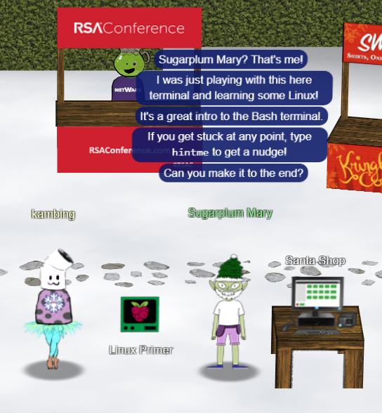

# Sugarplum Mary

---

## Linux Primer



*Current Area: Courtyard*

### Solution

Clicking on the Linux Primer will reveal a terminal with the following text:

```
The North Pole 🍭 Lollipop Maker:
All the lollipops on this system have been stolen by munchkins. Capture munchkins by following instructions here and 🍭's
 will appear in the green bar below. Run the command "hintme" to receive a hint.
─────────────────────────────────────────────────────────────────────────────────────────────────────
Type "yes" to begin: 
```

Following the instruction, we enter "yes":

```
Perform a directory listing of your home directory to find a munchkin and retrieve a lollipop!

elf@1376a292a3c9:~$ ls
HELP  munchkin_19315479765589239  workshop
```

Continuing

```
Now find the munchkin inside the munchkin.

elf@1376a292a3c9:~$ cat munchkin_19315479765589239 
munchkin_24187022596776786
```

```
Great, now remove the munchkin in your home directory.

elf@1376a292a3c9:~$ rm munchkin_19315479765589239 
```

```
Print the present working directory using a command.

elf@1376a292a3c9:~$ pwd
/home/elf
```

```
Good job but it looks like another munchkin hid itself in you home directory. Find the hidden munchkin!

elf@1376a292a3c9:~$ ls -a
.  ..  .bash_history  .bash_logout  .bashrc  .munchkin_5074624024543078  .profile  HELP  workshop
```

```
Excellent, now find the munchkin in your command history.

elf@1376a292a3c9:~$ history 
    1  echo munchkin_9394554126440791
    2  ls
    3  cat munchkin_19315479765589239 
    4  rm munchkin_19315479765589239 
    5  pwd
    6  ls -l
    7  ls -a
    8  history 
```

```
Find the munchkin in your environment variables.

elf@1376a292a3c9:~$ printenv
LC_ALL=C.UTF-8
LS_COLORS=rs=0:di=01;34:ln=01;36:mh=00:pi=40;33:so=01;35:do=01;35:bd=40;33;01:cd=40;33;01:or=40;31;01:mi=00:su=37;41:sg=3
0;43:ca=30;41:tw=30;42:ow=34;42:st=37;44:ex=01;32:*.tar=01;31:*.tgz=01;31:*.arc=01;31:*.arj=01;31:*.taz=01;31:*.lha=01;31
:*.lz4=01;31:*.lzh=01;31:*.lzma=01;31:*.tlz=01;31:*.txz=01;31:*.tzo=01;31:*.t7z=01;31:*.zip=01;31:*.z=01;31:*.Z=01;31:*.d
z=01;31:*.gz=01;31:*.lrz=01;31:*.lz=01;31:*.lzo=01;31:*.xz=01;31:*.zst=01;31:*.tzst=01;31:*.bz2=01;31:*.bz=01;31:*.tbz=01
;31:*.tbz2=01;31:*.tz=01;31:*.deb=01;31:*.rpm=01;31:*.jar=01;31:*.war=01;31:*.ear=01;31:*.sar=01;31:*.rar=01;31:*.alz=01;
31:*.ace=01;31:*.zoo=01;31:*.cpio=01;31:*.7z=01;31:*.rz=01;31:*.cab=01;31:*.wim=01;31:*.swm=01;31:*.dwm=01;31:*.esd=01;31
:*.jpg=01;35:*.jpeg=01;35:*.mjpg=01;35:*.mjpeg=01;35:*.gif=01;35:*.bmp=01;35:*.pbm=01;35:*.pgm=01;35:*.ppm=01;35:*.tga=01
;35:*.xbm=01;35:*.xpm=01;35:*.tif=01;35:*.tiff=01;35:*.png=01;35:*.svg=01;35:*.svgz=01;35:*.mng=01;35:*.pcx=01;35:*.mov=0
1;35:*.mpg=01;35:*.mpeg=01;35:*.m2v=01;35:*.mkv=01;35:*.webm=01;35:*.ogm=01;35:*.mp4=01;35:*.m4v=01;35:*.mp4v=01;35:*.vob
=01;35:*.qt=01;35:*.nuv=01;35:*.wmv=01;35:*.asf=01;35:*.rm=01;35:*.rmvb=01;35:*.flc=01;35:*.avi=01;35:*.fli=01;35:*.flv=0
1;35:*.gl=01;35:*.dl=01;35:*.xcf=01;35:*.xwd=01;35:*.yuv=01;35:*.cgm=01;35:*.emf=01;35:*.ogv=01;35:*.ogx=01;35:*.aac=00;3
6:*.au=00;36:*.flac=00;36:*.m4a=00;36:*.mid=00;36:*.midi=00;36:*.mka=00;36:*.mp3=00;36:*.mpc=00;36:*.ogg=00;36:*.ra=00;36
:*.wav=00;36:*.oga=00;36:*.opus=00;36:*.spx=00;36:*.xspf=00;36:
TOKENS=
LESSCLOSE=/usr/bin/lesspipe %s %s
LANG=C.UTF-8
HOSTNAME=1376a292a3c9
GREENSTATUSPREFIX=Lollipops
USER=elf
HHCUSERNAME=kambing
PWD=/home/elf
AREA=courtyard
HOME=/home/elf
TMUX=/tmp/tmux-1050/default,16,0
BPUSER=elf
z_MUNCHKIN=munchkin_20249649541603754
LOCATION=15,11
RESOURCE_ID=37d731cd-6b18-4023-ba27-941bf15d001d
MAIL=/var/mail/elf
SHELL=/bin/bash
TERM=screen
TMOUT=3600
TMUX_PANE=%2
SHLVL=4
BPUSERHOME=/home/elf
SESSNAME=Munchkin Wrangler
LOGNAME=elf
PATH=/usr/local/sbin:/usr/local/bin:/usr/sbin:/usr/bin:/sbin:/bin:/usr/games:/usr/local/games:/snap/bin
LESSOPEN=| /usr/bin/lesspipe %s
_=/usr/bin/printenv
```

```
Next, head into the workshop.

elf@1376a292a3c9:~$ cd workshop/
```

```
A munchkin is hiding in one of the workshop toolboxes. Use "grep" while ignoring case to find which toolbox the munchkin is in.

elf@1376a292a3c9:~/workshop$ grep -i "munchkin" ./*
grep: ./electrical: Is a directory
./toolbox_191.txt:mUnChKin.4056180441832623
```

```
A munchkin is blocking the lollipop_engine from starting. Run the lollipop_engine binary to retrieve this munchkin.

elf@1376a292a3c9:~/workshop$ ./lollipop_engine
bash: ./lollipop_engine: Permission denied
elf@1376a292a3c9:~/workshop$ chmod +x lollipop_engine 
elf@1376a292a3c9:~/workshop$ ./lollipop_engine
munchkin.898906189498077
```

```
Munchkins have blown the fuses in /home/elf/workshop/electrical. cd into electrical and rename blown_fuse0 to fuse0.

elf@1376a292a3c9:~/workshop$ cd electrical/
elf@1376a292a3c9:~/workshop/electrical$ mv blown_fuse0 fuse0
```

```
Now, make a symbolic link (symlink) named fuse1 that points to fuse0

elf@1376a292a3c9:~/workshop/electrical$ ln -s fuse0 fuse1
```

```
Make a copy of fuse1 named fuse2.

elf@1376a292a3c9:~/workshop/electrical$ cp fuse1 fuse2
```

```
We need to make sure munchkins don't come back. Add the characters "MUNCHKIN_REPELLENT" into the file fuse2.

elf@1376a292a3c9:~/workshop/electrical$ echo "MUNCHKIN_REPELLENT" > fuse2
```

```
Find the munchkin somewhere in /opt/munchkin_den.

elf@1376a292a3c9:~/workshop/electrical$ cd /opt/munchkin_den
elf@1376a292a3c9:/opt/munchkin_den$ find . -iname *munchkin*
./apps/showcase/src/main/resources/mUnChKin.6253159819943018
```

```
Find the file somewhere in /opt/munchkin_den that is owned by the user munchkin.

elf@1376a292a3c9:/opt/munchkin_den$ find . -user munchkin
./apps/showcase/src/main/resources/template/ajaxErrorContainers/niKhCnUm_9528909612014411
```

```
Find the file created by munchkins that is greater than 108 kilobytes and less than 110 kilobytes located somewhere in /opt/munchkin_den.

elf@1376a292a3c9:/opt/munchkin_den$ find . -type f -size +108k -size -110k
./plugins/portlet-mocks/src/test/java/org/apache/m_u_n_c_h_k_i_n_2579728047101724
```

```
List running processes to find another munchkin.

elf@1376a292a3c9:/opt/munchkin_den$ top
```

```
The 14516_munchkin process is listening on a tcp port. Use a command to have the only listening port display to the screen.

elf@1376a292a3c9:/opt/munchkin_den$ netstat -napt
(Not all processes could be identified, non-owned process info
 will not be shown, you would have to be root to see it all.)
Active Internet connections (servers and established)
Proto Recv-Q Send-Q Local Address           Foreign Address         State       PID/Program name    
tcp        0      0 0.0.0.0:54321           0.0.0.0:*               LISTEN      949/python3   
```

```
The service listening on port 54321 is an HTTP server. Interact with this server to retrieve the last munchkin.

elf@1376a292a3c9:/opt/munchkin_den$ curl 0.0.0.0:54321
munchkin.73180338045875
```

```
elf@1376a292a3c9:/opt/munchkin_den$ kill 949
```

---

