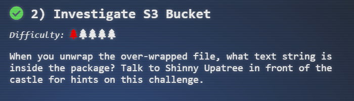

# 2) Investigate S3 Bucket

*Current Area: Castle Approach*


---

## Objective



---

## Hints

1. 

   [search for unprotected buckets](https://digi.ninja/projects/bucket_finder.php)

   

2. 

   

3. 

   [finding these open S3 buckets](https://digi.ninja/blog/whats_in_amazons_buckets.php)

   

4. 

   [Amazon S3 buckets](https://www.computerweekly.com/news/252491842/Leaky-AWS-S3-bucket-once-again-at-centre-of-data-breach)

   

5. 

   [talk](https://www.youtube.com/watch?v=t4UzXx5JHk0)

---

## Solution

Click on the terminal:

```
Can you help me? Santa has been experimenting with new wrapping technology, and
we've run into a ribbon-curling nightmare!
We store our essential data assets in the cloud, and what a joy it's been!
Except I don't remember where, and the Wrapper3000 is on the fritz!

Can you find the missing package, and unwrap it all the way?

Hints: Use the "file" command to identify a file type. You can also examine
tool help using the "man" command. Search all man pages for a string such as
a file extension using the "apropos" command.

To see this help again, run "cat /etc/motd".
elf@7f923d5d5b37:~$ 
```

First, let's list all the available files in the current folder using `ls -l`:

```
elf@7f923d5d5b37:~$ ls -l
total 8
-rw-r--r-- 1 elf elf  179 Dec  5 00:00 TIPS
drwxr-xr-x 1 elf elf 4096 Dec 17 13:08 bucket_finder
```

Let's take a look at `TIPS`:

```
elf@7f923d5d5b37:~$ cat TIPS
# TIPS
- If you need an editor to create a file you can run nano (vim is also
  available).
- Everything you need to solve this challenge is provided in this terminal
  session.
```

Ok good to know. Now let's check out what is in the `bucket_finder` folder:

```
elf@7f923d5d5b37:~$ cd bucket_finder/
elf@7f923d5d5b37:~/bucket_finder$ ls
README  bucket_finder.rb  wordlist
```

Inside consists of 3 files:

- The `README` and `bucket_finder.rb` is basically the same files downloaded off the link in hint 1.
- `wordlist` file

Let's check out the `README` before to see the usage:

```
elf@7f923d5d5b37:~/bucket_finder$ cat README
Bucket Finder
=============
Copyright(c) 2011, Robin Wood <robin@digininja.org>
This project goes alongside my blog post "Whats In Amazon's Buckets?"
http://www.digininja.org/blog/whats_in_amazons_buckets.php , read through that
for more information on what is going on behind the scenes.
This is a fairly simple tool to run, all it requires is a wordlist and it will
go off and check each word to see if that bucket name exists in the Amazon's
S3 system. Any that it finds it will check to see if the bucket is public,
private or a redirect.
Public buckets are checked for directory indexing being enabled, if it is then
all files listed will be checked using HEAD to see if they are public or private.
Redirects are followed and the final destination checked. All this is reported
on so you can later go through and analyse what has been found.
Version
=======
1.0 - Release
1.1 - Added logging to file
Installation
============
I don't think it needs anything more than the built in modules so you shouldn't
need to install any gems. Just grab the file, make it executable and run it.
I've tested it in Ruby 1.8.7 and 1.9.1 so there should be no problems with versions.
Usage
=====
Basic usage is simple, just start it with a wordlist:

./bucket_finder.rb my_words

and it will go off and do your bidding.

You can specify which region you want to run the initial check against by using
the --region parameter:

./bucket_finder.rb --region ie my_words

The script will follow all redirects anyway so even if left at default, US Standard,
everything will be found that can be found but if most of the buckets you are
finding are in a different region then you'll be doing a lot of redirects so doubling
your network traffic.

You can also specify the --download option to download all public files found. Be
careful with this as there are a lot of large files out there. I'd personally do
the general search then only use this option with a select subset of bucket names:

./bucket_finder.rb --download --region ie my_words

The files are downloaded into a folder with the bucket name and then the appropriate
structure from the bucket. 

As some people are having trouble piping the output to files or other apps I've added
a logging option to send all output to a file. To use this just use the --log-file 
parameter:

./bucket_finder.rb --log-file bucket.out my_words

Licence
=======
This project released under the Creative Commons Attribution-Share Alike 2.0
UK: England & Wales
( http://creativecommons.org/licenses/by-sa/2.0/uk/ )
```

The usage is given as follows: `./bucket_finder.rb my_words`. Changing to the wordlist that we have, we get:

```
elf@7f923d5d5b37:~/bucket_finder$ ./bucket_finder.rb wordlist
http://s3.amazonaws.com/kringlecastle
Bucket found but access denied: kringlecastle
http://s3.amazonaws.com/wrapper
Bucket found but access denied: wrapper
http://s3.amazonaws.com/santa
Bucket santa redirects to: santa.s3.amazonaws.com
http://santa.s3.amazonaws.com/
        Bucket found but access denied: santa
```

So far, all these buckets are private.

However, one of those links look familiar: `http://s3.amazonaws.com/wrapper`

Let's instead try to use `wrapper3000` as hinted in the *Hints* section and also during the start of the terminal:

```
elf@7f923d5d5b37:~/bucket_finder$ curl http://s3.amazonaws.com/wrapper3000
<?xml version="1.0" encoding="UTF-8"?>
<ListBucketResult xmlns="http://s3.amazonaws.com/doc/2006-03-01/"><Name>wrapper3000</Name><Prefix>
</Prefix><Marker></Marker><MaxKeys>1000</MaxKeys><IsTruncated>false</IsTruncated><Contents><Key>pa
ckage</Key><LastModified>2020-12-04T11:43:39.000Z</LastModified><ETag>&quot;14bfb2b3daf66375c088e4
62ac69fbd9&quot;</ETag><Size>829</Size><StorageClass>STANDARD</StorageClass></Contents></ListBucke
tResult>
```

Indeed, we got a hit!

Inside we can see that there is indeed a package `..<Key>package</Key>..`

Let's check it out:

```
elf@7f923d5d5b37:~/bucket_finder$ curl http://s3.amazonaws.com/wrapper3000/package
UEsDBAoAAAAAAIAwhFEbRT8anwEAAJ8BAAAcABwAcGFja2FnZS50eHQuWi54ei54eGQudGFyLmJ6MlVUCQADoBfKX6AXyl91eAsAAQT2AQAABBQAAABCWmg5MUFZJlNZ2ktivwABHv+Q3hASgGSn//AvBxDwf/xe0gQAAAgwAVmkYRTKe1PVM9U0ekMg2poAAAGgPUPUGqehhCMSgaBoAD1NNAAAAyEmJpR5QGg0bSPU/VA0eo9IaHqBkxw2YZK2NUASOegDIzwMXMHBCFACgIEvQ2Jrg8V50tDjh61Pt3Q8CmgpFFunc1Ipui+SqsYB04M/gWKKc0Vs2DXkzeJmiktINqjo3JjKAA4dLgLtPN15oADLe80tnfLGXhIWaJMiEeSX992uxodRJ6EAzIFzqSbWtnNqCTEDML9AK7HHSzyyBYKwCFBVJh17T636a6YgyjX0eE0IsCbjcBkRPgkKz6q0okb1sWicMaky2Mgsqw2nUm5ayPHUeIktnBIvkiUWxYEiRs5nFOM8MTk8SitV7lcxOKst2QedSxZ851ceDQexsLsJ3C89Z/gQ6Xn6KBKqFsKyTkaqO+1FgmImtHKoJkMctd2B9JkcwvMr+hWIEcIQjAZGhSKYNPxHJFqJ3t32Vjgn/OGdQJiIHv4u5IpwoSG0lsV+UEsBAh4DCgAAAAAAgDCEURtFPxqfAQAAnwEAABwAGAAAAAAAAAAAAKSBAAAAAHBhY2thZ2UudHh0LloueHoueHhkLnRhci5iejJVVAUAA6AXyl91eAsAAQT2AQAABBQAAABQSwUGAAAAAAEAAQBiAAAA9QEAAAAA
```

Looks like a base64 encoded string.

Let's download this output first so we can work on it:

```
elf@7f923d5d5b37:~/bucket_finder$ curl http://s3.amazonaws.com/wrapper3000/package > package
 % Total    % Received % Xferd  Average Speed   Time    Time     Time  Current
                                 Dload  Upload   Total   Spent    Left  Speed
100   829  100   829    0     0   7085      0 --:--:-- --:--:-- --:--:--  7085
```

Followed by some recon:

```
elf@7f923d5d5b37:~/bucket_finder$ ls -l
total 24
-rw-r--r-- 1 elf elf 2550 Dec  5 00:00 README
-rwxr-xr-x 1 elf elf 9121 Dec 17 13:08 bucket_finder.rb
-rw-r--r-- 1 elf elf  829 Jan  6 05:00 package
-rw-r--r-- 1 elf elf   28 Dec  5 00:00 wordlist
elf@7f923d5d5b37:~/bucket_finder$ file package 
package: ASCII text, with very long lines
```

Now, let's decode it:

```
base64 -d package > base64decoded
```

Check the contents of the decoded file.

```
elf@7f923d5d5b37:~/bucket_finder$ cat base64decoded 
PK
�0�Q
??��   package.txt.Z.xz.xxd.tar.bz2UT  ��_��_ux
                                                   �BZh91AY&SY�Kb�����d���/    ��^�0Y�a�{S�3�4zC ښ�=C� ?���#��h=M4!&&�y@h4m#��P4z�Hhz��6a��5@9�#<
                                                          \�P��/Cbk��y�� ㇭O�t<
h)[�sR)�/���Ӄ?�b�sEl�5���f�KH6��ܘ�  .�<�y��{�-���^h�"  ��ݮƇQ'�́s�&ֶsj   10�@+��K<��PU&{O��k� �5�x�&�p >
���Z���x�/=g��y�(�²NF�;�E�b&�r�&C�݁���+��      ��F�"�4�G$Z����V8'��@���.�p�!���~PK
�0�Q
??��  ?��package.txt.Z.xz.xxd.tar.bz2UT��_ux
                                               �PKb�elf
```

Mostly gibberish but there is useful piece of string there: `package.txt.Z.xz.xxd.tar.bz2`

Let's check what sort of file this really is:

```
elf@7f923d5d5b37:~/bucket_finder$ file base64decoded 
base64decoded: Zip archive data, at least v1.0 to extract
```

It is a *Zip* file. Let's unzip and check the file.

```
elf@7f923d5d5b37:~/bucket_finder$ unzip base64decoded 
Archive:  base64decoded
 extracting: package.txt.Z.xz.xxd.tar.bz2
elf@7f923d5d5b37:~/bucket_finder$ file package.txt.Z.xz.xxd.tar.bz2 
package.txt.Z.xz.xxd.tar.bz2: bzip2 compressed data, block size = 900k
```

Looks like we have many layers of compression here. I will proceed with the decompression layer-by-layer:

- *.bz2*

```
elf@7f923d5d5b37:~/bucket_finder$ bzip2 -d package.txt.Z.xz.xxd.tar.bz2
```

- *.tar*

```
elf@7f923d5d5b37:~/bucket_finder$ tar -xvf package.txt.Z.xz.xxd.tar 
```

- *.xxd*

```
elf@7f923d5d5b37:~/bucket_finder$ xxd -r package.txt.Z.xz.xxd > package.txt.Z.xz
```

- *.xz*

```
elf@7f923d5d5b37:~/bucket_finder$ xz -d package.txt.Z.xz 
```

- *.Z*

```
elf@7f923d5d5b37:~/bucket_finder$ uncompress package.txt.Z
```

*.txt*

```
elf@7f923d5d5b37:~/bucket_finder$ cat package.txt
```

The final step gets us the text file which we can just read to get us the flag:

---

## Flag

```
North Pole: The Frostiest Place on Earth
```

